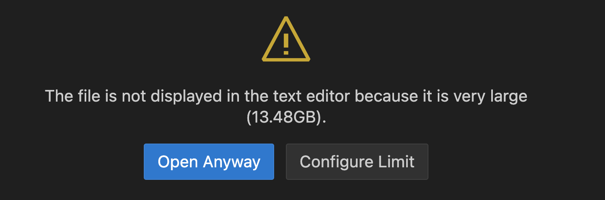

# SamplerBigWig

less_memory там, где разными способами пробую считывать с файла в который записываю в битах. Есть свой preprocess. Надо запустить перед использованием.

bin_files - тут попытка записывать 4 one_hot вектора в binary file и работа с ними. Но DNA тогда получается размером 38gb. Тоже есть свой preprocess

main - работа c обычным HOMO_sapiens....

numpy_arr - сохранение 4 numpy array. Если переводить 10 хромосом, то каждый из 4 numpy array займет 13 gb

## DNA

| Tool        | hdf5    | bin file | numpy_arr |
| :---:       | :---:   | :---:    |  :---:    |
| Size in GB  | 93.57   | 93.57    |   92.4    |
| Time in min | 94      |   -      |   40      |

PS. пробовала сохранять массив букв в numpy.arr, для 3 хромосом получилось 82 gb